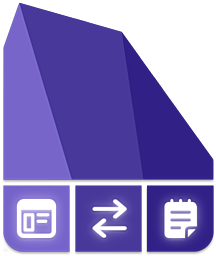

# Actions URI

This plugin adds additional `x-callback-url` endpoints to
[Obsidian](https://obsidian.md) for common actions — it's a clean, super-charged
addition to the built-in [Obsidian URIs](https://help.obsidian.md/Advanced+topics/Using+obsidian+URI#Using+Obsidian+URIs).

## Installation

1. Search for "Actions URI" in Obsidian's community plugins browser.
2. Enable the plugin in your Obsidian settings under "Community plugins".

That's it.

## Installation via BRAT (for pre-releases or betas)

1. Install [BRAT](https://github.com/TfTHacker/obsidian42-brat).
2. Add "Actions URI" to BRAT:
    1. Open "Obsidian42 - BRAT" via Settings → Community Plugins
    2. Click "Add Beta plugin"
    3. Use the repository address `czottmann/obsidian-actions-uri`
3. Enable "Actions URI" under Settings → Options → Community Plugins

## New `x-callback-url` Endpoints

TODO

## Development

Clone the repository, run `pnpm install` OR `npm install` to install the
dependencies.  Afterwards, run `pnpm dev` OR `npm run dev` to compile and have
it watch for file changes.

## Thanks to …

- the [obsidian-tasks](https://github.com/obsidian-tasks-group/obsidian-tasks)
  crew for the "starter templates" for the GitHub Action workflow and the handy
  `release.sh` script

## Author

Carlo Zottmann, <carlo@zottmann.org>, https://zottmann.org/

## License

MIT, see [LICENSE.md](LICENSE.md).
